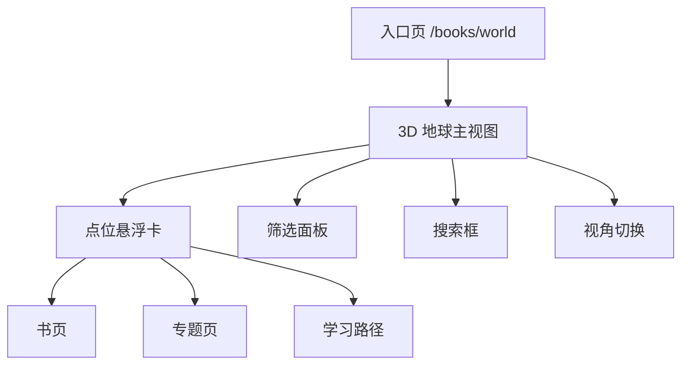

# 3D 地球书库页面结构图

> 版本：v0.1
> 目标：把“空间化知识入口”拆成可执行页面结构

## 1. 一句话结构

```text
首页入口 -> 3D 地球主视图 -> 点位信息卡 -> 书页 / 专题页 / 学习路径
```

## 2. 页面层级



## 3. 视觉区块

### 3.1 顶部栏

- 标题：书的世界 / 知识星球 / 空间浏览器
- 搜索框
- 视角切换：书 / 主题 / 地点 / 作者
- 返回按钮

### 3.2 中央主场景

- 地球或球体
- 内容点位
- 轻量轨道光效
- 当前选中项高亮

### 3.3 右侧或底部信息卡

- 名称
- 一句话说明
- 标签
- 相关内容推荐
- 进入详情按钮

### 3.4 底部工具条

- 缩放提示
- 筛选入口
- 重置视角
- 切换专题世界

## 4. 交互链路

```text
进入页面
-> 默认展示一个主题簇
-> 用户拖动旋转
-> 用户缩放查看局部
-> 用户点中某个点位
-> 弹出信息卡
-> 用户进入书页/专题页/路径页
```

## 5. 首版信息层级

第一版只保留四级信息：

1. 世界总标题
2. 点位名称
3. 一句话说明
4. 进入详情

不要在首版塞太多解释，否则会把“探索感”压没。

## 6. 推荐首版点位组织方式

### 6.1 按内容类型

- 书
- 主题
- 地点
- 作者

### 6.2 按主题分簇

例如：

- 自我探索簇
- 关系沟通簇
- 旅行与地方簇
- 学习与表达簇

## 7. 页面切换策略

- 默认进入一个“世界总览”
- 点击右上角切换不同专题世界
- 每个专题世界保持自己的点位密度和视觉气质
- 详情仍回到标准书页 / 专题页，避免 3D 页面承担过多内容

## 8. 验收标准

- 用户能看懂这是一个可探索世界
- 用户能从总览进入局部
- 用户能清楚知道点位是什么
- 用户能从点位跳到详情页
