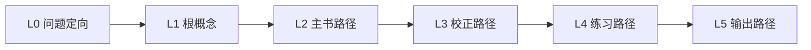

# GitHub 热门应用源码学习报告与工具应用方案

> 日期：2026-04-30  
> 本地样本目录：`05temp/github_samples/book-kb-multi_2026-04-30_slices/`  
> 关联项目：`book-kb-multi` 多书知识站 / 思想伙伴选配器 / 学习路径地图 / 内容生产流水线  
> 结论版本：v0.1 源码切片学习版

## 0. 一句话结论

这一轮代码阅读后，最值得马上进入我们项目的是 **Mermaid**：依赖已经在 `web/package.json` 里，源码 API 也适合 Vue 单组件封装，可以直接把学习路径的 L0-L5 从文字列表升级成结构图。

**Flowise 和 n8n 不建议整套接入**，但非常值得学习它们的工作流数据结构：节点有类型、输入、输出、状态，连线可以同时保存 source map 和 destination map。这个模式可以用于思想伙伴选配器的匹配链路、内容生产流水线和后续“学习路径生成器”。

**Excalidraw 和 tldraw 暂时不要直接接入主站**。它们都是 React 生态，接入成本和维护边界比当前收益大；但它们的只读画布、导出图片、手绘视觉可以作为后续可编辑地图和分享卡的参考。

## 1. 本轮具体读了哪些代码

| 项目 | 本地代码切片 | 读到的核心信号 | 对我们的判断 |
| --- | --- | --- | --- |
| Mermaid | `mermaid-js__mermaid/packages/mermaid/src/mermaid.ts`、`packages/mermaid/package.json` | `parse`、`render`、`run` 三个入口清晰；`render` 返回 SVG；多次渲染会进队列串行执行；`run` 会扫描 `.mermaid` 并打 `data-processed` 标记 | 直接接入，用于学习路径结构图 |
| Excalidraw | `excalidraw__excalidraw/packages/excalidraw/README.md`、`package.json`、浏览器示例 | React 组件；必须导入 CSS；父容器必须有高度；导出 API 从包根导入；字体资源可自托管 | 不进主站，借鉴分享图和手绘语气 |
| tldraw | `tldraw__tldraw/packages/tldraw/README.md`、只读示例、导出示例 | React SDK；`editor.updateInstanceState({ isReadonly: true })` 支持只读；`editor.toImage()` 支持导出当前画布形状 | 不进主站，未来需要可编辑画布再评估 |
| Flowise | `FlowiseAI__Flowise/packages/ui/src/views/canvas/index.jsx`、`ConversationChain.ts`、`File.ts` | Canvas 用 `nodes + edges` 保存流程；节点类型、输入输出、脏状态、导入导出分层明显；组件节点用 `label/name/version/category/inputs/outputs/init/run` 描述 | 学它的节点规范和流程 JSON，不接 ReactFlow |
| n8n | `n8n-io__n8n/packages/workflow/src/workflow.ts`、`ManualTrigger.node.ts`、评估 runner | Workflow 内部把节点数组转成 name map，同时维护 source/destination 两套连接；Trigger 节点有明确约束；评估 runner 把生成、评分、耗时、错误统一成结果 | 用于本地流水线 schema 和验收评估 |

## 2. Mermaid：可以马上落地的结构图组件

源码里最关键的是 `mermaid.ts` 的几个设计点：

- `RunOptions` 支持 `querySelector`、`nodes`、`postRenderCallback`、`suppressErrors`。
- `run()` 默认找 `.mermaid` 元素，渲染后打 `data-processed`，适合普通网页自动扫描。
- `parse(text, { suppressErrors: true })` 语法不合法时返回 `false`，可以做温和降级。
- `render(id, text, container)` 返回 `{ svg, bindFunctions }`，适合我们在 Vue 里主动把 SVG 放进容器。
- `parse` 和 `render` 都进入内部 `executionQueue` 串行执行，避免同一页面多图并发渲染互相踩状态。
- `package.json` 显示 Mermaid 当前切片版本为 `11.14.0`，MIT，ESM；我们自己的 `web/package.json` 已经有 `"mermaid": "^11.14.0"`。

**对我们最好的用法：**

不要用 `mermaid.run()` 扫描整个 DOM，而是封装一个小组件，例如：

```text
web/src/components/MermaidDiagram.vue
```

组件职责：

- 接收 `source` 字符串。
- `onMounted` 和 `watch(source)` 时调用 `mermaid.parse(source, { suppressErrors: true })`。
- 语法通过后调用 `mermaid.render(stableId, source)`。
- `container.innerHTML = svg` 后执行 `bindFunctions?.(container)`。
- 语法失败时显示轻量 fallback，不影响学习路径列表。

建议初始化：

```js
mermaid.initialize({
  startOnLoad: false,
  securityLevel: 'strict',
  theme: 'base',
})
```

**接入位置：**

- [LearningPathMap.vue](../../../web/src/components/LearningPathMap.vue)：在现有 `stage-list` 上方或旁边增加“结构图 / 列表”切换。
- [learningPathData.js](../../../web/src/data/learningPathData.js)：给每条 path 增加 `diagram` 字段，或者写一个 `buildLearningPathMermaid(path)` 函数从 `stages` 自动生成。
- [web/package.json](../../../web/package.json)：无需新增依赖，已有 `mermaid`。

**最小 POC DSL：**



这一步可以把当前“学习路径 Seed”从列表变成真正的地图，但仍然保持 Vue 代码简单。

## 3. Flowise：学习工作流产品的节点规范

Flowise 的 Canvas 代码值得拆成两层看。

第一层是画布状态：

- `index.jsx` 用 `useNodesState()` 和 `useEdgesState()` 管理流程。
- `nodeTypes = { customNode, stickyNote }`，`edgeTypes = { buttonedge }`，说明节点和连线都可以有业务类型。
- `onConnect(params)` 不只是加一条 edge，还会更新目标节点的 `inputAnchors`，相当于连线会改变节点输入状态。
- `handleLoadFlow(file)` 直接 `JSON.parse(file)`，再 `setNodes(flowData.nodes || [])`、`setEdges(flowData.edges || [])`。
- 保存时用 `reactFlowInstance.toObject()`，最终保存的核心就是一份 `flowData` JSON。
- 所有编辑动作会调用 `setDirty()`，离开时用 unsaved changes 提醒。

第二层是节点插件：

- `ConversationChain.ts` 里，一个节点类有 `label/name/version/type/icon/category/description/baseClasses/inputs`。
- `init()` 负责准备链路，`run()` 负责执行。
- 输入里包含 `model`、`memory`、`chatPromptTemplate`、`inputModeration`、`systemMessagePrompt`。
- 执行前会先做 moderation，失败时返回格式化错误，而不是让整条链路崩掉。
- `File.ts` 把文件节点设计成通用 Document Loader：输入是文件、Text Splitter、PDF 使用方式、metadata、omitMetadataKeys；输出可以是 document 或 text；内部用 `MultiFileLoader` 根据扩展名分派 JSON/CSV/PDF/DOCX/PPTX 等 loader。

**我们应该学的不是 ReactFlow，而是节点契约。**

思想伙伴选配器当前在 [ThoughtPartnerTool.vue](../../../web/src/components/ThoughtPartnerTool.vue) 里已经有一条隐形流程：

```text
选择困境 -> 微调承接方式/表达气质/目标 -> 计算能力轴 -> 选择 5 类思想伙伴 -> 最小行动 -> 行动反馈 -> 洞察卡
```

下一步可以把这条链路沉淀成显式 workflow schema：

```json
{
  "id": "thought-partner-selection.v0.1",
  "nodes": [
    { "id": "scene", "type": "input.scene", "label": "当前困境" },
    { "id": "signals", "type": "input.tuning", "label": "承接方式/气质/目标" },
    { "id": "axes", "type": "derive.axes", "label": "能力轴判断" },
    { "id": "roles", "type": "derive.roles", "label": "五类角色分工" },
    { "id": "partners", "type": "rank.thinkers", "label": "思想伙伴排序" },
    { "id": "action", "type": "derive.minimumAction", "label": "最小行动" },
    { "id": "insight", "type": "feedback.insight", "label": "行动回馈洞察" }
  ],
  "edges": [
    ["scene", "axes"],
    ["signals", "roles"],
    ["axes", "partners"],
    ["roles", "partners"],
    ["partners", "action"],
    ["action", "insight"]
  ]
}
```

有了这个 schema，后续可以做三件事：

- 让产品文档、规则代码和可视化图谱共用一套流程定义。
- 把每个节点的输入、输出、失败兜底写清楚，方便测试。
- 后续若做“AI 自动生成学习路径”，可以先生成 workflow JSON，再渲染页面。

## 4. n8n：学习稳定流水线的内部结构

n8n 的 `Workflow` 类有一个特别值得借鉴的结构：外部传入 `nodes: INode[]` 和 `connections: IConnections`，构造时内部转成三类索引。

- `nodes: INodes = {}`：用节点名做 map，便于快速查找。
- `connectionsBySourceNode`：从源节点出发看下游。
- `connectionsByDestinationNode`：通过 `mapConnectionsByDestination()` 反推上游。
- `getTriggerNodes()`、`getPollNodes()`、`queryNodes()`：把“找某类节点”变成统一查询函数。
- `getChildNodes()`、`getParentNodes()`：支持按连接方向追溯流程。

`ManualTrigger.node.ts` 也有一个好设计：它是 trigger 组，`maxNodes: 1`，`inputs: []`，`outputs: [Main]`，并且有 builder hint 告诉用户一个 workflow 只能有一个手动触发节点。

评估 runner 里还读到一条工程习惯：生成 workflow 后，不只保存结果，还收集 token、耗时、节点数、评估反馈、错误反馈，并用 pass/fail 阈值汇总。

**对我们的落地方式：**

不要把 n8n 接进项目。我们应该在自己的项目里做一个小型、透明、可版本化的 pipeline schema。

适合先用于三类流程：

1. `learning-path-generation.v0.1`  
   从用户困境生成 L0-L5 学习路径，再校验是否有主书、概念、练习和输出。

2. `thought-partner-selection.v0.1`  
   把当前 `ThoughtPartnerTool.vue` 的隐形规则拆成节点，后续可以逐节点测试。

3. `content-production.v0.1`  
   面向小红书内容生产：选题 -> 母书/概念 -> 4-0 图文 -> 4-2 信息图 -> 质检 -> 发布登记。

建议 schema 最少包含：

```json
{
  "id": "content-production.v0.1",
  "nodes": [],
  "connectionsBySource": {},
  "manualGates": ["human_topic_confirm", "pre_publish_check"],
  "validators": ["no_placeholder", "book_slug_exists", "output_format_complete"]
}
```

这比直接上 n8n 更贴合当前本地文件系统和内容生产场景。

## 5. Excalidraw 与 tldraw：先学体验，不急着接依赖

Excalidraw 的 README 写得很直接：它导出的是 React component；安装时要带 `react react-dom @excalidraw/excalidraw`；必须导入 CSS；父容器没有高度会空白；SSR 要 client-only；字体资源可以通过 `window.EXCALIDRAW_ASSET_PATH` 自托管。

tldraw 的示例展示了两个对我们有用的体验点：

- 只读模式：`editor.updateInstanceState({ isReadonly: true })`，工具栏只保留选择、手型、激光笔。
- 导出图片：`editor.getCurrentPageShapeIds()` 拿到形状，再 `editor.toImage([...shapeIds], { format: 'png', background: false })` 生成 blob。

但二者都要求 React peer dependencies。tldraw 的 package 还显示 license 指向单独 `LICENSE.md`，不能在没有审查许可证的情况下贸然嵌入商业或公开产品。

**我们的取舍：**

- 当前主站是 Vue + Vite，不为白板功能引入 React runtime。
- 当前学习路径只需要“读图”，不是“用户编辑画布”，Mermaid 已足够。
- 当前分享卡导出已经在 `ThoughtPartnerTool.vue` 里有 Canvas fallback，可以继续沿用，不必为了导出图片接入 tldraw。
- 后续如果真的要做“用户自己拖拽学习路径节点”，再单独评估 tldraw / Excalidraw / Vue Flow 三者，不和本轮 Mermaid POC 混在一起。

## 6. 具体怎么用到我们项目里

### 6.1 第一优先级：学习路径地图 Mermaid POC

目标：让 `/tools/learning-paths` 的 3 条静态样张都有一张结构图。

改动建议：

| 文件 | 改动 |
| --- | --- |
| `web/src/components/MermaidDiagram.vue` | 新建通用 Mermaid 渲染组件 |
| `web/src/components/LearningPathMap.vue` | 在 `path-board` 增加结构图区域；保留原 stage list 作为细节导航 |
| `web/src/data/learningPathData.js` | 增加 `buildLearningPathMermaid(path)` 或每条 path 的 `diagram` 字段 |
| `web/src/style.css` 或组件 scoped CSS | 给 SVG 容器加稳定高度、横向滚动和错误 fallback 样式 |

验收标准：

- 切换三条学习路径时 Mermaid 图同步刷新。
- Mermaid 语法错误时不白屏，显示列表 fallback。
- `npm run build` 通过。
- 桌面和移动端 SVG 不遮挡文字，不挤压 stage detail。

### 6.2 第二优先级：思想伙伴选配器流程显式化

目标：把当前散落在 `ThoughtPartnerTool.vue` 的匹配过程抽出一个轻量流程层。

改动建议：

| 文件 | 改动 |
| --- | --- |
| `web/src/lib/thoughtPartnerWorkflow.js` | 新建 workflow schema、节点执行顺序、输入输出校验 |
| `web/src/components/ThoughtPartnerTool.vue` | 保留 UI，逐步把 `buildResolvedPartnerSet()`、`scoreThinkerForRole()` 迁到 lib |
| `web/src/data/thoughtPartnerData.js` | 保持知识数据，不再承担流程解释 |
| `03_产品项目文档/04_研发交付/33_测试计划与验收用例.md` | 增加每个节点的验收用例 |

可学习 Flowise 的节点字段：

```json
{
  "id": "rank.thinkers",
  "label": "思想伙伴排序",
  "version": 1,
  "category": "Selection",
  "inputs": ["scene", "signals", "axes", "roles"],
  "outputs": ["partnerSet", "scoreTrace"],
  "fallback": "usePresetPartnerSet"
}
```

### 6.3 第三优先级：内容生产流水线 schema

目标：把当前“人工靠文档推进”的内容生产流程，变成可检查的本地 pipeline。

可先放在：

```text
04_operations/04_products_and_experiments/book-kb-multi/configs/workflows/
```

或如果和运行脚本联动，则放到：

```text
04_operations/06_ops_runtime/scripts/
04_operations/06_ops_runtime/logs/
```

建议先做一个 JSON 文件，而不是直接写复杂调度器：

```json
{
  "id": "xhs-book-card-production.v0.1",
  "trigger": "manual",
  "nodes": [
    { "id": "select_book", "type": "manual.choice", "label": "选择书与选题" },
    { "id": "extract_skeleton", "type": "book.skeleton", "label": "整本书知识骨架" },
    { "id": "generate_post_prompt", "type": "prompt.4-0", "label": "小红书图文提示词" },
    { "id": "generate_infographic_prompt", "type": "prompt.4-2", "label": "高密度信息图提示词" },
    { "id": "quality_gate", "type": "validator", "label": "占位符/跑题/章节漂移检查" },
    { "id": "release_registry", "type": "manual.registry", "label": "登记发布中控台" }
  ],
  "manualGates": ["select_book", "release_registry"]
}
```

这个方向借鉴 n8n 的 trigger/manual gate，也借鉴 Flowise 的 node metadata，但实现保持本地、轻量、可读。

## 7. 不建议做的事

- 不建议把 Flowise/n8n 作为运行依赖接进主站；它们的依赖、认证、存储、部署都超出当前 MVP。
- 不建议为了白板效果引入 React、ReactFlow、tldraw 或 Excalidraw；当前项目的核心不是画布编辑器。
- 不建议让 Mermaid 渲染用户任意输入的 DSL；第一版只渲染我们自己从结构化数据生成的图。
- 不建议把学习路径图做成唯一导航；文字列表仍要保留，因为它承载资源打开、练习、输出任务。
- 不建议把 pipeline schema 直接做成大而全的自动化平台；先用于检查和对齐，再决定是否自动执行。

## 8. 推荐实现路径

| 阶段 | 时间 | 做什么 | 产出 |
| --- | --- | --- | --- |
| P0 | 现在 | Mermaid POC 接入学习路径 | `MermaidDiagram.vue` + `LearningPathMap.vue` 结构图 |
| P1 | 1-2 天 | 抽出 `thoughtPartnerWorkflow.js` | 思想伙伴匹配流程可测试、可解释 |
| P2 | 2-3 天 | 写 `learning-path-generation.v0.1` schema | 后续 AI 生成学习路径有统一结构 |
| P3 | 3-5 天 | 写内容生产 pipeline schema 和校验脚本 | 小红书/书籍资产生产可以被流水线检查 |
| P4 | 未来 | 评估可编辑画布 | 只有当用户需要拖拽编辑路径时再启动 |

## 9. 最终建议

本轮最务实的路线是：

1. **用 Mermaid 把学习路径地图先做出来。** 这是低成本、高可见度、和现有需求完全对齐的动作。
2. **用 Flowise/n8n 的源码思想重构我们的流程数据，而不是接它们的系统。** 当前项目更需要“可解释的节点与连接”，不是另一个平台。
3. **把 Excalidraw/tldraw 留作下一阶段画布产品参考。** 它们很强，但现在进入主站会把简单问题复杂化。

如果只选一个马上动手的任务，就是：`DEV-028 Mermaid 学习路径结构图 POC`。
