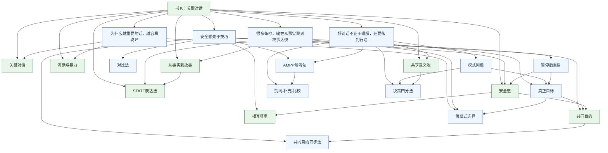

# 《关键对话：如何高效能沟通（原书第2版）（珍藏版）》整本书 K 卡 / N 卡总表

## 这份总表解决什么

- 把 11 章资产收敛成一套最小可用的 `K / N` 卡骨架。
- 先做概念去重，再决定哪些卡直接复用、哪些值得单独长出来。
- 把“书内逻辑”翻译成“卡片路由”，方便后续继续扩成 `K` 卡、`N` 卡、课程页和内容页。

## 去重原则

1. 已有卡如果已经能承接本书核心判断，就直接复用，不重复立卡。
2. 书里只是作为动作步骤出现、但尚不足以跨场景调用的内容，先挂在上位卡下，不急着拆独立卡。
3. 如果本书对某个方法或判断给出了足够清晰的边界、场景和调用价值，就单独立新卡。
4. 先优先沉淀能在高风险沟通、反馈、管理和亲密关系中重复调用的概念，再考虑更细碎的子动作。

## 总收敛结论

- 已有锚点 `K` 卡：`1`
- 已创建第一批 `K` 卡：`4`
- 直接复用的主干 `N` 卡：`8`
- 已创建 `N` 卡：`9`
- 暂不独立、先挂在上位卡下的候选概念：`2`

## 一、K 卡总表

| 卡名 | 状态 | 角色 | 来源章节 | 去重结论 | 说明 |
| --- | --- | --- | --- | --- | --- |
| [关键对话：如何高效能沟通（原书第2版）（珍藏版）](../../../../../02_collections/3_K_themes/02_by_book/关键对话：如何高效能沟通（原书第2版）（珍藏版）.md) | 已有 | 书 K 锚点 | 全书 | 保留 | 负责整本书的主线、总判断和入口路由 |
| [为什么越重要的话，越容易说坏](../../../../../02_collections/3_K_themes/01_by_theme/为什么越重要的话，越容易说坏.md) | 已创建 | 识别 K | 1、2、4 | 新增独立卡 | 串联关键对话定义、傻瓜式选择、沉默与暴力信号 |
| [安全感先于技巧：让对话回到可谈状态](../../../../../02_collections/3_K_themes/01_by_theme/安全感先于技巧：让对话回到可谈状态.md) | 已创建 | 安全 K | 4、5、8 | 新增独立卡 | 串联安全感、共同目的、对比法、AMPP 倾听法 |
| [很多争吵，输在从事实跳到故事太快](../../../../../02_collections/3_K_themes/01_by_theme/很多争吵，输在从事实跳到故事太快.md) | 已创建 | 认知 K | 3、6、7 | 新增独立卡 | 串联真正目标、从事实到故事、STATE 表达法 |
| [好对话不止于理解，还要落到行动](../../../../../02_collections/3_K_themes/01_by_theme/好对话不止于理解，还要落到行动.md) | 已创建 | 行动 K | 8、9、11 | 新增独立卡 | 串联倾听、差异处理、决策四分法与执行闭环 |

## 二、N 卡主干总表

### 1. 直接复用的已有 N 卡

| 卡名 | 状态 | 来源章节 | 为什么保留 | 挂接 K |
| --- | --- | --- | --- | --- |
| [关键对话](../../../../../02_collections/2_N_concepts/N_notes/关键对话.md) | 已有 | 1、2 | 全书基础定义，不能去掉 | 书 K / 识别 K |
| [共享意义池](../../../../../02_collections/2_N_concepts/N_notes/共享意义池.md) | 已有 | 2、9 | 已足以承接书中的“共享观点库”角色 | 书 K / 行动 K |
| [沉默与暴力](../../../../../02_collections/2_N_concepts/N_notes/沉默与暴力.md) | 已有 | 2、4、8 | 是安全危机的总分类卡 | 书 K / 识别 K / 安全 K |
| [安全感](../../../../../02_collections/2_N_concepts/N_notes/安全感.md) | 已有 | 4、5、8 | 是全书最重要的前提概念之一 | 书 K / 安全 K |
| [共同目的](../../../../../02_collections/2_N_concepts/N_notes/共同目的.md) | 已有 | 5、8 | 已能承接安全修复与合作导向 | 书 K / 安全 K |
| [相互尊重](../../../../../02_collections/2_N_concepts/N_notes/相互尊重.md) | 已有 | 5、7 | 是安全感持续因素，不必重复立卡 | 书 K / 安全 K |
| [从事实到故事](../../../../../02_collections/2_N_concepts/N_notes/从事实到故事.md) | 已有 | 6、7 | 是认知链条最关键的桥梁概念 | 书 K / 认知 K |
| [STATE表达法](../../../../../02_collections/2_N_concepts/N_notes/STATE表达法.md) | 已有 | 7 | 已能承接书中“综合陈述法”的主体内容 | 书 K / 认知 K |

### 2. 已创建的 N 卡

| 卡名 | 状态 | 来源章节 | 为什么值得独立立卡 | 挂接位置 |
| --- | --- | --- | --- | --- |
| [真正目标](../../../../../02_collections/2_N_concepts/N_notes/真正目标.md) | 已创建 | 3、6 | 它是从“心”开始的判断中心，比泛化的“目标感”更适合关键对话场景 | 认知 K / 安全 K |
| [傻瓜式选择](../../../../../02_collections/2_N_concepts/N_notes/傻瓜式选择.md) | 已创建 | 2、3 | 这是整本书最关键的错误框架之一，值得独立反复调用 | 识别 K / 认知 K |
| [对比法](../../../../../02_collections/2_N_concepts/N_notes/对比法.md) | 已创建 | 5、7、10 | 它已经不只是安全感子动作，而是高风险澄清误解的高频方法卡 | 安全 K |
| [共同目的四步法](../../../../../02_collections/2_N_concepts/N_notes/共同目的四步法.md) | 已创建 | 5 | 它把“共同目的”从概念推进成破局路径，具有独立方法价值 | 安全 K |
| [AMPP倾听法](../../../../../02_collections/2_N_concepts/N_notes/AMPP倾听法.md) | 已创建 | 8 | 它是帮助对方走出沉默或暴力的完整倾听框架，适合单独调用 | 安全 K / 行动 K |
| [赞同-补充-比较](../../../../../02_collections/2_N_concepts/N_notes/赞同-补充-比较.md) | 已创建 | 8 | 它稳定承接“听完之后如何不同意”的高频难点 | 安全 K / 行动 K |
| [决策四分法](../../../../../02_collections/2_N_concepts/N_notes/决策四分法.md) | 已创建 | 9 | 它补齐了从对话走向执行的关键收束卡 | 行动 K |
| [模式问题](../../../../../02_collections/2_N_concepts/N_notes/模式问题.md) | 已创建 | 10 | 它把“反复谈同一件事”从情绪抱怨升级成结构判断，具备跨场景复用价值 | 行动 K |
| [暂停后重启](../../../../../02_collections/2_N_concepts/N_notes/暂停后重启.md) | 已创建 | 10 | 它把“先停一下”从逃避动作升级成节奏设计，边界和调用价值都已足够清晰 | 安全 K |

### 3. 暂不独立、先挂在上位卡下的候选概念

| 概念 | 当前处理方式 | 先挂到哪里 | 为什么暂时不急着独立 |
| --- | --- | --- | --- |
| 沉默三形态：掩饰 / 逃避 / 退缩 | 挂在上位卡 | `沉默与暴力` | 目前更适合作为分类说明，还不够独立承担跨场景判断 |
| 暴力三形态：控制 / 贴标签 / 攻击 | 挂在上位卡 | `沉默与暴力` | 与上位卡关系过近，先不拆散 |

## 三、最小可用卡组

### 1. 当前就能跑起来的骨架

- `K`：[关键对话：如何高效能沟通（原书第2版）（珍藏版）](../../../../../02_collections/3_K_themes/02_by_book/关键对话：如何高效能沟通（原书第2版）（珍藏版）.md) + [为什么越重要的话，越容易说坏](../../../../../02_collections/3_K_themes/01_by_theme/为什么越重要的话，越容易说坏.md) + [安全感先于技巧：让对话回到可谈状态](../../../../../02_collections/3_K_themes/01_by_theme/安全感先于技巧：让对话回到可谈状态.md)
- `N`：[关键对话](../../../../../02_collections/2_N_concepts/N_notes/关键对话.md) / [共享意义池](../../../../../02_collections/2_N_concepts/N_notes/共享意义池.md) / [沉默与暴力](../../../../../02_collections/2_N_concepts/N_notes/沉默与暴力.md) / [安全感](../../../../../02_collections/2_N_concepts/N_notes/安全感.md) / [共同目的](../../../../../02_collections/2_N_concepts/N_notes/共同目的.md) / [从事实到故事](../../../../../02_collections/2_N_concepts/N_notes/从事实到故事.md) / [STATE表达法](../../../../../02_collections/2_N_concepts/N_notes/STATE表达法.md) / [真正目标](../../../../../02_collections/2_N_concepts/N_notes/真正目标.md) / [傻瓜式选择](../../../../../02_collections/2_N_concepts/N_notes/傻瓜式选择.md)

### 2. 已补齐的 9 张 N 卡

1. [真正目标](../../../../../02_collections/2_N_concepts/N_notes/真正目标.md)
2. [傻瓜式选择](../../../../../02_collections/2_N_concepts/N_notes/傻瓜式选择.md)
3. [对比法](../../../../../02_collections/2_N_concepts/N_notes/对比法.md)
4. [共同目的四步法](../../../../../02_collections/2_N_concepts/N_notes/共同目的四步法.md)
5. [AMPP倾听法](../../../../../02_collections/2_N_concepts/N_notes/AMPP倾听法.md)
6. [赞同-补充-比较](../../../../../02_collections/2_N_concepts/N_notes/赞同-补充-比较.md)
7. [决策四分法](../../../../../02_collections/2_N_concepts/N_notes/决策四分法.md)
8. [模式问题](../../../../../02_collections/2_N_concepts/N_notes/模式问题.md)
9. [暂停后重启](../../../../../02_collections/2_N_concepts/N_notes/暂停后重启.md)

### 3. 已补齐的 4 张 K 卡

1. [为什么越重要的话，越容易说坏](../../../../../02_collections/3_K_themes/01_by_theme/为什么越重要的话，越容易说坏.md)
2. [安全感先于技巧：让对话回到可谈状态](../../../../../02_collections/3_K_themes/01_by_theme/安全感先于技巧：让对话回到可谈状态.md)
3. [很多争吵，输在从事实跳到故事太快](../../../../../02_collections/3_K_themes/01_by_theme/很多争吵，输在从事实跳到故事太快.md)
4. [好对话不止于理解，还要落到行动](../../../../../02_collections/3_K_themes/01_by_theme/好对话不止于理解，还要落到行动.md)

## 四、挂接关系图

## 五、从章节资产到卡片的映射

- [第01章 何谓关键对话](<单章深入提取_第01章_何谓关键对话.md>)
  对应：`关键对话`、识别 K 主问题
- [第02章 掌握关键对话](<单章深入提取_第02章_掌握关键对话.md>)
  对应：`共享意义池`、`沉默与暴力`、`傻瓜式选择`
- [第03章 从“心”开始](<单章深入提取_第03章_从心开始.md>)
  对应：`真正目标`、`傻瓜式选择`
- [第04章 注意观察](<单章深入提取_第04章_注意观察.md>)
  对应：`沉默与暴力`、安全 K 诊断入口
- [第05章 保证安全](<单章深入提取_第05章_保证安全.md>)
  对应：`安全感`、`共同目的`、`相互尊重`、`对比法`、`共同目的四步法`
- [第06章 控制想法](<单章深入提取_第06章_控制想法.md>)
  对应：`从事实到故事`、`真正目标`
- [第07章 陈述观点](<单章深入提取_第07章_陈述观点.md>)
  对应：`STATE表达法`、认知 K
- [第08章 了解动机](<单章深入提取_第08章_了解动机.md>)
  对应：`AMPP倾听法`、`赞同-补充-比较`
- [第09章 开始行动](<单章深入提取_第09章_开始行动.md>)
  对应：`决策四分法`、行动 K
- [第10章 案例分析](<单章深入提取_第10章_案例分析.md>)
  对应：`模式问题`、`暂停后重启`、边界场景补充
- [第11章 综合应用](<单章深入提取_第11章_综合应用.md>)
  对应：四张 K 卡的整合调用逻辑

## 六、推进状态与下一步

1. 已完成：把新增 `N` 卡继续扩到 `9` 张，并补进书 `K` 页、相关主题页和章节映射里。
2. 当前最顺的下一步：把四张 `K` 卡扩写成更偏内容生产的项目页或讲稿页。
3. 下一轮候选：继续观察 `沉默三形态` 与 `暴力三形态` 是否值得拆成独立卡。
