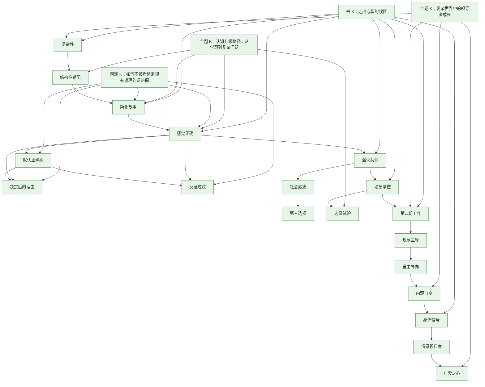

# K卡N卡总表

## 这份总表解决什么
- 把 7 章资产收敛成一套最小可用的 `K / N` 卡骨架。
- 先做概念去重，再决定哪些卡直接复用、哪些值得作为这本书的专属入口长出来。
- 把“书内逻辑”翻译成“卡片路由”，方便后续继续扩成 `K` 卡、`N` 卡、内容页与课程页。

## 去重原则
1. 已有卡如果已经能准确承接这本书的关键判断，就直接复用，不重复立卡。
2. 如果现有卡够宽但不够精，只把它当上位卡使用，再看是否值得补一张更贴近本书的新卡。
3. 只在这本书给出明显更强的判断价值、可迁移方法或高频误判入口时，才建议新增独立卡。
4. 章节里的动作、案例和场景，优先挂到概念或问题卡下，而不是拆成一堆彼此孤立的技巧卡。

## 总收敛结论
- 原有锚点 `K` 卡：`4`
- 本轮已新增 `K` 卡：`4`
- 原有主干 `N` 卡：`18`
- 本轮已新增 `N` 卡：`4`
- 当前最小主干总数：`K 8 / N 22`
- 先挂在上位卡下、不急着独立立卡的二级概念：`6`

## 一、K 卡总表
| 卡名 | 状态 | 角色 | 来源章节 | 去重结论 | 说明 |
| --- | --- | --- | --- | --- | --- |
| [[走出心智的误区]] | 已有 | 书 K 锚点 | 全书 | 保留 | 负责整本书的主问题、五大误区总入口与章节总路由 |
| [[复杂世界中的领导者成长]] | 已有 | 主题 K 锚点 | 1-7 章 | 保留 | 承接“复杂世界中的判断、成长与领导”这一跨书主题 |
| [[认知升级路径：从学习到复杂问题]] | 已有 | 主题 K 锚点 | 1-7 章 | 保留 | 负责从旧直觉到复杂判断系统升级的跨书复用 |
| [[如何不被看起来很有道理的话带偏]] | 已有 | 问题 K 入口 | 2-4 章 | 保留 | 最适合承接“故事、正确感、共识”这一组连续误判 |
| [[旧脑子遇上新世界：为什么复杂环境会放大直觉误判]] | 已创建 | 观点 K | 1-4 章 | 本轮新增 | 用来承接本书根问题，比单个概念卡更适合做总入口 |
| [[为什么一团和气的团队反而更危险]] | 已创建 | 场景 K | 4 章 | 本轮新增 | 串联 `社会疼痛`、`渴求共识`、`妥协`、`第三选择` |
| [[控制感越强，越可能错失复杂系统的真实杠杆]] | 已创建 | 方法 K | 5 章 | 本轮新增 | 适合把 `渴望掌控` 与 `边缘试验`、`影响力` 连接起来 |
| [[别再替完美自我辩护，把自己当成一件未完成的作品]] | 已创建 | 成长 K | 6-7 章 | 本轮新增 | 承接 `第二份工作`、心智发展与最终的整合式成长出口 |

## 二、N 卡主干总表
### 1. 直接复用的已有 N 卡
| 卡名                                                                       | 状态  | 来源章节  | 为什么保留                            | 挂接 K        |
| ------------------------------------------------------------------------ | --- | ----- | -------------------------------- | ----------- |
| [[复杂性]]         | 已有  | 1、5、7 | 这是全书判断环境类型的总透镜，不能去掉              | 书 K / 主题 K  |
| [[结构性错配]]     | 已有  | 1     | 虽然来源更泛，但足以承接“问题不只在动作，而在环境与机制不匹配” | 书 K         |
| [[简化故事]]       | 已有  | 2     | 第一批核心误区之一，已可稳定复用                 | 书 K / 问题 K  |
| [[感觉正确]]       | 已有  | 3     | 第二批核心误区入口，已足够稳定                  | 书 K / 问题 K  |
| [[为了学习而倾听]] | 已有  | 3、7   | 是本书最重要的关系动作之一，直接可复用              | 问题 K / 主题 K |
| [[社会疼痛]]       | 已有  | 4     | 是理解团队为何压平分歧的关键机制                 | 书 K / 场景 K  |
| [[渴求共识]]       | 已有  | 4     | 已能直接承接共识误区                       | 书 K / 场景 K  |
| [[妥协]]           | 已有  | 4     | 可作为泛卡复用，但不代替本书对 `第三选择` 的强调       | 场景 K        |
| [[渴望掌控]]       | 已有  | 5     | 章节主概念已经存在                        | 书 K / 方法 K  |
| [[边缘试验]]       | 已有  | 5     | 是从掌控转向干预的关键动作概念                  | 方法 K / 主题 K |
| [[第二份工作]]     | 已有  | 6     | 本书最有识别度的概念之一，已可直接调用              | 成长 K        |
| [[规范主导]]       | 已有  | 6     | 成人发展框架的起点，不需要重复立卡                | 成长 K / 主题 K |
| [[自主导向]]       | 已有  | 6     | 成人发展框架核心阶段之一                     | 成长 K / 主题 K |
| [[内观自变]]       | 已有  | 6、7   | 是本书成长出口的高阶概念，必须保留                | 成长 K / 主题 K |
| [[身体信号]]       | 已有  | 7     | 是最终行动框架的重要入口                     | 成长 K / 主题 K |
| [[情感颗粒度]]     | 已有  | 7     | 已足以承接情绪觉察部分                      | 成长 K / 主题 K |
| [[仁爱之心]]       | 已有  | 7     | 承接本书最后的整合性落点                     | 成长 K / 主题 K |
| [[正念阶梯]]       | 已有  | 7     | 能直接承接“身体-情感-目标-仁爱”的阶梯结构          | 成长 K        |

### 2. 本轮新增的第一批 N 卡
| 卡名 | 状态 | 来源章节 | 为什么值得独立立卡 | 挂接位置 |
| --- | --- | --- | --- | --- |
| [[决定后的理由]] | 已创建 | 3 | 这是本书解释“先判断后找理由”的关键节点，现有 `理由` 太泛 | 问题 K |
| [[默认正确感]] | 已创建 | 3 | 这是“[[感觉正确]]”为何如此顽固的底层解释，值得从主概念里单拉出来 | 问题 K |
| [[反证过滤]] | 已创建 | 3 | 它把“正确感”具体化为信息处理机制，后续可高频复用 | 问题 K |
| [[第三选择]] | 已创建 | 4 | 现有 `妥协` 足够泛，但不足以承接本书对“超越[[妥协]]”的强调 | 场景 K |

### 3. 先挂上位卡、不急着独立立卡的二级概念
| 概念       | 处理方式 | 先挂到哪里           | 理由                      |
| -------- | ---- | --------------- | ----------------------- |
| 旧心智操作系统  | 并入   | `结构性错配` / `复杂性` | 它更像解释性比喻，不必先拆独立卡        |
| 五大心智误区   | 并入   | `走出心智的误区`       | 作为书 K 的主框架足够，不必先拆成总概念卡  |
| 自动补全缺失信息 | 并入   | `简化故事`          | 这是主概念的组成动作，先挂在上位卡下更稳    |
| 可衡量替代目标  | 二级子卡 | `渴望掌控`          | 它更像掌控误区下的高频表现，不一定第一批就独立 |
| 完美人设成本   | 二级子卡 | `第二份工作`         | 可作为场景展开，不急着先立单卡         |
| 误区预警信号   | 二级子卡 | `身体信号` / `正念阶梯` | 更适合作为最终行动框架下的展开节点       |

### 4. 已有泛概念卡的使用方式
| 现有卡 | 处理方式 | 原因 |
| --- | --- | --- |
| [[妥协]] | 保留为跨书泛卡 | 可继续保留，但不代替 `第三选择` |
| [[为了学习而倾听]] | 保留为关键动作卡 | 这张卡已经足够精确，直接作为本书高频动作入口 |
| [[结构性错配]] | 保留为背景卡 | 可以承接第一章，但需在本书语境里具体化为“旧脑子遇上新世界” |

## 三、最小可用卡组
### 1. 当前就能跑起来的骨架
- `K`：[[走出心智的误区]] + [[复杂世界中的领导者成长]] + [[认知升级路径：从学习到复杂问题]] + [[如何不被看起来很有道理的话带偏]]
- `N`：[[复杂性]] / [[简化故事]] / [[感觉正确]] / [[社会疼痛]] / [[渴望掌控]] / [[边缘试验]] / [[第二份工作]] / [[规范主导]] / [[自主导向]] / [[内观自变]] / [[身体信号]] / [[情感颗粒度]]

### 2. 本轮已补上的 4 张 N 卡
1. [[决定后的理由]]
2. [[默认正确感]]
3. [[反证过滤]]
4. [[第三选择]]

### 3. 本轮已补上的 4 张 K 卡
1. [[旧脑子遇上新世界：为什么复杂环境会放大直觉误判]]
2. [[为什么一团和气的团队反而更危险]]
3. [[控制感越强，越可能错失复杂系统的真实杠杆]]
4. [[别再替完美自我辩护，把自己当成一件未完成的作品]]

## 四、挂接关系图

## 五、从章节资产到卡片的映射
- 第1章 心智误区的由来
  对应：`复杂性`、`结构性错配`、书 K 主问题
- 第2章 [[简化故事]]的心智误区
  对应：`简化故事` 及“多版本解释”的方法出口
- 第3章 [[感觉正确]]的心智误区
  对应：`感觉正确`、`决定后的理由`、`反证过滤`、`为了学习而倾听`
- 第4章 [[渴求共识]]的心智误区
  对应：`社会疼痛`、`渴求共识`、`妥协`、`第三选择`
- 第5章 [[渴望掌控]]的心智误区
  对应：`渴望掌控`、`边缘试验`
- 第6章 捍卫自我的心智误区
  对应：`第二份工作`、`规范主导`、`自主导向`、`内观自变`
- 第7章 构建走出心智误区的阶梯
  对应：`身体信号`、`情感颗粒度`、`仁爱之心`、`正念阶梯`

## 六、下一步最顺的推进顺序
1. 先把本轮新增的 `4` 张 `N` 卡和 `4` 张 `K` 页继续挂回更多主题页、问题页与内容页。
2. 优先从 [[第三选择]]、[[决定后的理由]]、[[控制感越强，越可能错失复杂系统的真实杠杆]] 往外长图文和讲稿。
3. 再从 `第二份工作`、`边缘试验`、`正念阶梯` 下面继续长二级子卡与内容页。

## 怎么用这张总表

- 先看 `K 8 / N 22` 的最小主干数，知道这本书目前的卡片骨架到底收到了哪里。
- 再看“挂接关系图”和“从章节资产到卡片的映射”，把章节、K 卡、N 卡和场景页串起来。
- 最后回到 [[走出心智的误区]]、[[为了学习而倾听]]、[[第三选择]]、[[边缘试验]] 等关键入口，继续往外长内容。
